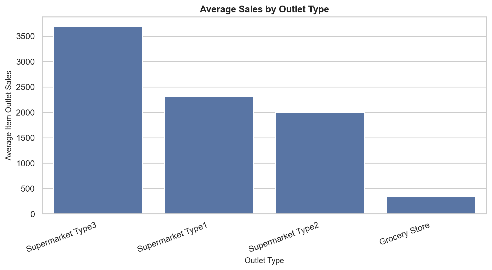
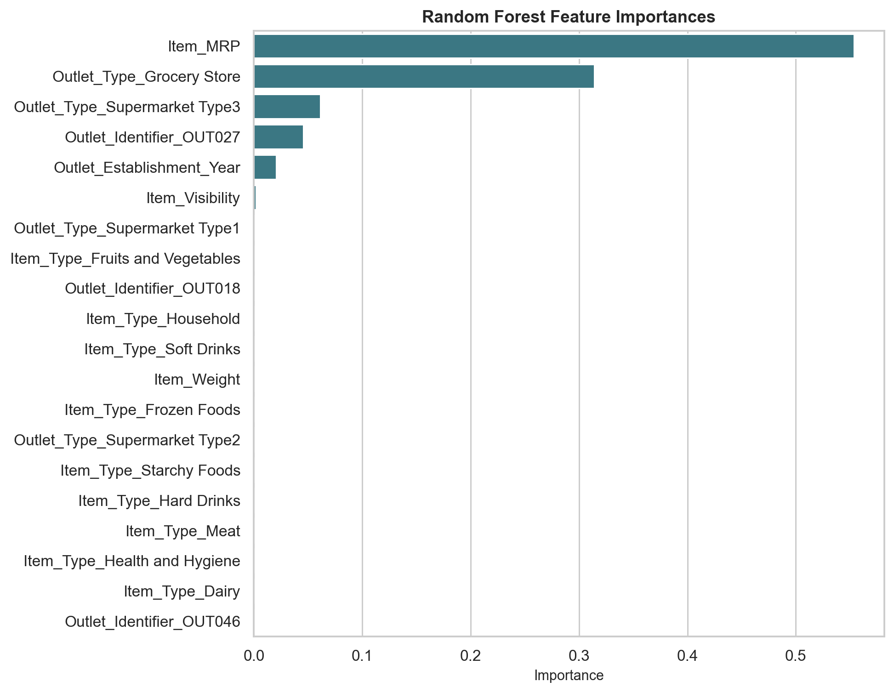
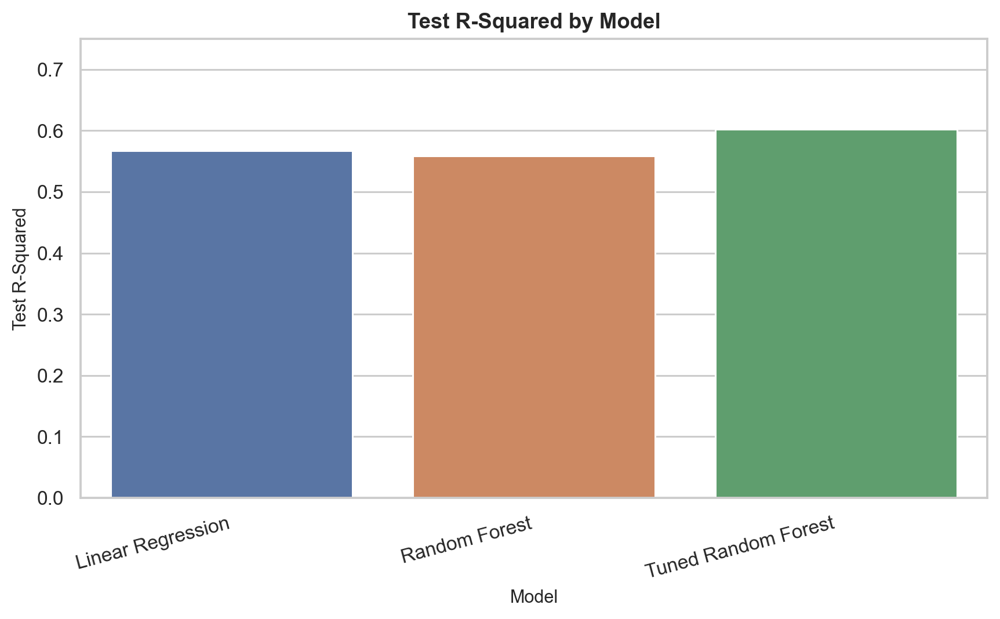
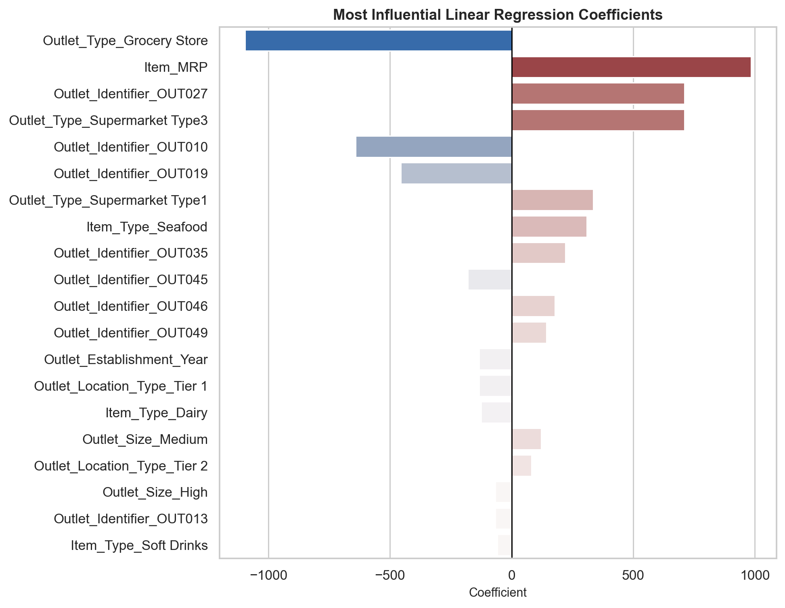

# Retail Sales Prediction

## Overview

This project predicts sales for food items sold across different retail outlets. The goal is to help the retailer understand which product and store characteristics most strongly influence item sales, then use those patterns to support better forecasting, assortment planning, and outlet strategy.

The dataset contains 8,523 rows and 12 columns. The target variable is `Item_Outlet_Sales`.

## Business Problem

Retail sales are influenced by both product attributes and outlet characteristics. This analysis identifies the most useful predictors of sales and compares regression models that can forecast item-level outlet sales on unseen data.

## Key Insights

### Outlet type is strongly related to sales



Supermarket formats, especially higher-performing supermarket types, produce higher average sales than grocery store outlets.

### Item price is the strongest model driver



The tuned Random Forest ranked `Item_MRP` as the most important predictor, followed by outlet format indicators such as grocery store and supermarket type.

## Model Performance

The recommended model is a tuned Random Forest Regressor. It produced the best test-set performance among the models evaluated.

| Model | Test R-squared | Test RMSE | Test MAE |
| --- | ---: | ---: | ---: |
| Tuned Random Forest | 0.6026 | 1,047.09 | 728.36 |
| Linear Regression | 0.5671 | 1,092.86 | 804.12 |
| Default Random Forest | 0.5588 | 1,103.32 | 768.82 |

In stakeholder terms, the tuned Random Forest explains about 60% of the variation in sales on unseen data. The RMSE of about 1,047 sales units means predictions are typically off by roughly that amount, making it useful as a planning tool while still leaving room for improvement.



## Model Interpretation

### Linear Regression Coefficients



The largest linear effects show that grocery store outlets are associated with lower predicted sales, while higher item MRP and the OUT027 outlet indicator are associated with higher predicted sales.

### Random Forest Feature Importance

The top five Random Forest features were:

| Rank | Feature | Interpretation |
| ---: | --- | --- |
| 1 | `Item_MRP` | Listed item price is the strongest signal for sales. |
| 2 | `Outlet_Type_Grocery Store` | Grocery stores behave differently from supermarket formats. |
| 3 | `Outlet_Type_Supermarket Type3` | Store format has a meaningful relationship with predicted sales. |
| 4 | `Outlet_Identifier_OUT027` | This outlet has a strong performance pattern captured by the model. |
| 5 | `Outlet_Establishment_Year` | Store age/history contributes a smaller but useful signal. |

## Recommendations

Focus forecasting and business review on item pricing, outlet format, and high-performing outlet patterns. Grocery store outlets may need a separate strategy from supermarket outlets because their sales behavior differs substantially. Future improvements could include adding time-based sales history, promotions, inventory availability, and local demographic data.

## Repository Structure

```text
data/
  raw/                 Original CSV file, ignored by Git
  processed/           Cleaned EDA snapshot
notebooks/
  01_eda.ipynb         Data cleaning, EDA, and feature inspection
  02_modeling.ipynb    Preprocessing, modeling, tuning, and interpretation
src/
  config.py            Paths and constants
  data_loader.py       Loading and cleaning helpers
  preprocessing.py     ColumnTransformer builders
  modeling.py          Model and tuning helpers
  evaluation.py        Regression metrics
  visualization.py     Plotting helpers
reports/
  figures/             Exported visualizations
models/                Local saved model artifacts, ignored by Git
```

## Reproducibility

Install the dependencies from `requirements.txt`, place the original dataset at `data/raw/sales_predictions.csv`, and run the workflow notebooks in order. The raw data used for this project came from the course-provided Google Drive file.
