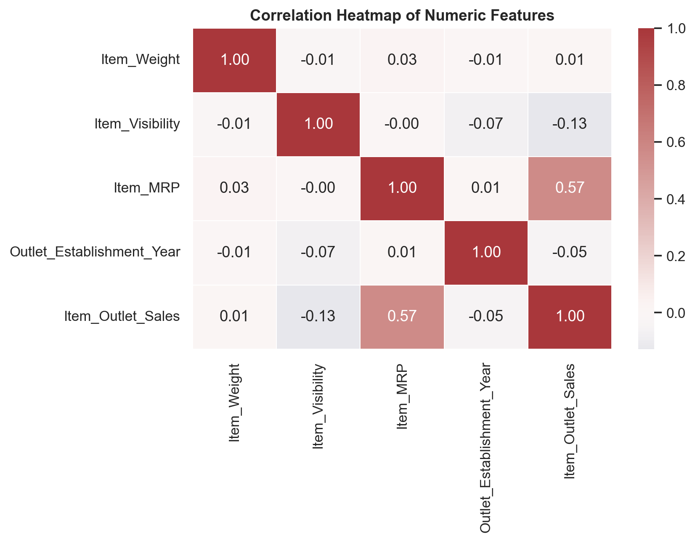
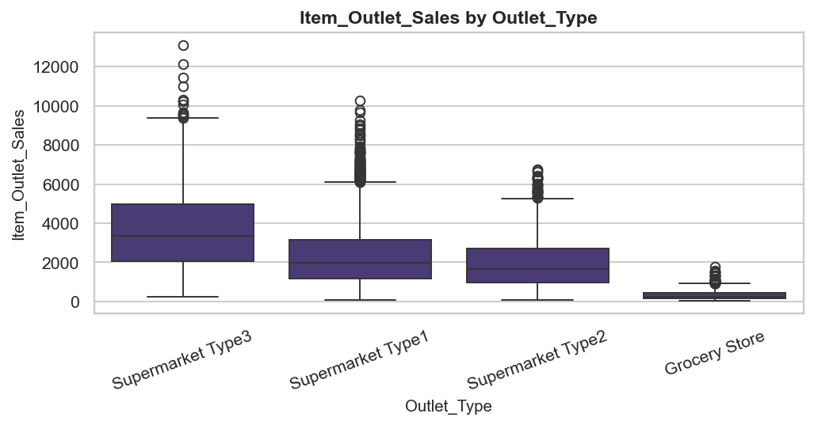

# Prediction of Product Sales

An end-to-end data-science walk-through of a retail sales dataset (8 523 rows, 12 columns), covering cleaning, exploratory analysis, per-feature inspection, and a leakage-free preprocessing pipeline ready for supervised regression.

The project is structured as a production-style Python project — modular `src/` package, reproducible notebook build, pinned modern dependencies — rather than a single ad-hoc notebook, to double as a software-engineering sample alongside the data-science deliverable.

**Target variable:** `Item_Outlet_Sales` — product revenue at a given outlet.
**Primary deliverable:** [`Prediction_of_Product_Sales.ipynb`](./Prediction_of_Product_Sales.ipynb).

---

## Key findings



*`Item_MRP` (list price) is the only numeric feature with a strong linear correlation to sales (r ≈ 0.57); every other numeric predictor is near-orthogonal, so downstream signal will mostly come from categoricals.*



*Store format is the single strongest discriminator of revenue — median sales at a `Supermarket Type3` outlet are roughly 5× those of a `Grocery Store`, dwarfing the effect of any product-level attribute.*

> Figures are generated automatically into `reports/figures/` when the notebook is executed end-to-end. If they do not render above, run the notebook once and commit the output.

---

## Methodology

The notebook walks through five sections, each corresponding to one project deliverable:

| # | Section | What happens |
|---|---|---|
| 1 | Project Overview | Business framing, data dictionary, success metric. |
| 2 | Load and Inspect Data | Cached Google Drive download, `info` / `head` / `describe`. |
| 3 | Clean Data | Dedup, null diagnostics, placeholder filling with a *restoration mask* so Part 4 can revert surgically, category normalization (`Item_Fat_Content`). |
| 4 | Exploratory Data Analysis | Histograms, boxplots, countplots, correlation heatmap, target-by-outlet breakdown. |
| 5 | Feature Inspection | Six-question audit per feature (type, null %, cardinality, leakage, business relevance, etc.) with univariate and bivariate visuals. |
| 6 | Modelling Preprocessing | Fresh reload, leakage-free `train_test_split`, `ColumnTransformer` with median/mode imputation and one-hot encoding. |

### Design decisions worth highlighting

- **Leakage-free imputation.** `SimpleImputer` is composed inside the `ColumnTransformer` *after* `train_test_split`, so imputation statistics (medians, modes) are learned from training data only.
- **Restoration-mask pattern.** Part-2 placeholders are reverted to `NaN` in Part 4 via a `NullMask` dataclass that captures the original null positions. Safer than a naive `df.replace(placeholder, NaN)`, which would also corrupt any legitimate values equal to the placeholder.
- **Frozen reference year for `Outlet_Age`.** We derive `Outlet_Age = 2013 - Outlet_Establishment_Year` rather than `datetime.now().year - year`, so retrains months apart produce identical features (silent feature drift is a frequent bug in naïve DS pipelines).
- **Deterministic plot theme.** A single call to `sns.set_theme` + `rcParams.update` at the top of the notebook means every figure is visually consistent; no per-plot style tweaking.

---

## Repository layout

```
Prediction-of-Product-Sales/
├── Prediction_of_Product_Sales.ipynb   # Primary deliverable (Colab-runnable)
├── README.md
├── requirements.txt                    # Pinned modern libraries
├── pyproject.toml                      # Project metadata + lint config
├── .gitignore
├── src/sales_prediction/               # Reusable package (tested in isolation)
│   ├── __init__.py
│   ├── config.py                       # Dataset URL, schema, constants
│   ├── data.py                         # Cached loader (Google Drive → local CSV)
│   ├── cleaning.py                     # Category normalization + NullMask
│   ├── features.py                     # Outlet_Age derivation
│   ├── eda.py                          # Reusable plotters
│   └── preprocessing.py                # ColumnTransformer factory
├── tools/
│   └── build_notebook.py               # Rebuilds the notebook from source
├── reports/figures/                    # Saved figures for README / reports
└── data/raw/                           # Downloaded CSV (git-ignored)
```

---

## Setup

### Option A — Colab (zero setup)

Open the notebook badge directly in Colab: `Prediction_of_Product_Sales.ipynb` is self-contained and will install `gdown` on first run.

### Option B — Local

```bash
git clone https://github.com/<your-username>/Prediction-of-Product-Sales.git
cd Prediction-of-Product-Sales
python -m venv .venv && source .venv/bin/activate    # or .venv\Scripts\activate on Windows
pip install -r requirements.txt
jupyter lab
```

Open `Prediction_of_Product_Sales.ipynb` and run all cells — the dataset is downloaded automatically on the first run and cached under `data/raw/`.

### Regenerating the notebook

The notebook is built from `tools/build_notebook.py`. To regenerate after editing cell sources:

```bash
python tools/build_notebook.py
```

---

## Tech stack

- **Core:** Python 3.11+, `pandas 2.2+`, `numpy 2.0+`, `scikit-learn 1.5+`
- **Visualization:** `matplotlib 3.9+`, `seaborn 0.13+`
- **Data retrieval:** `gdown 5.2+`
- **Lint / style:** `ruff` (config in `pyproject.toml`)

---

## Next steps

Future iterations of this portfolio project will layer on:

1. **Baseline regressors** — Linear Regression, Ridge, Random Forest, compared via CV on RMSE / MAE / R².
2. **Gradient-boosted tree** — `HistGradientBoostingRegressor` or LightGBM with Optuna search.
3. **Error analysis** — residual plots stratified by `Outlet_Type` and `Item_Type`.
4. **Interpretation** — SHAP to surface per-feature contributions in a business-readable form.

---

## Author

**Ashraf Alkahlout** — Computer Engineering graduate (GPA 88%), Frontend (Nextjs + supabase ) , and ML Engineer 
